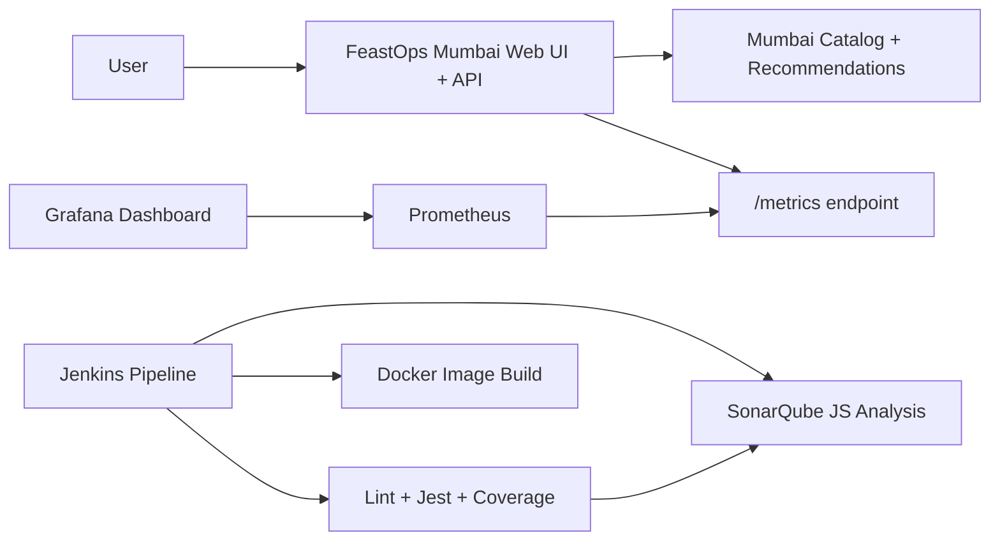

# FeastOps Food Delivery DevOps Project

FeastOps is a Mumbai-focused Swiggy/Zomato-style food delivery demo built as a practical DevOps portfolio project.

It demonstrates a full local DevOps flow:

- Docker Compose runs the complete environment
- The application is packaged as one reusable Docker image
- The application image can be pushed to Docker Hub, GHCR, ECR, or another registry
- Jenkins automates CI stages
- Jest generates test coverage
- SonarQube analyzes real JavaScript code and imports coverage
- Prometheus scrapes application metrics
- Grafana visualizes those metrics

## What The Project Does

The app models a Mumbai food delivery platform:

- Customers browse an 18-restaurant Mumbai catalog with 70+ menu items
- Customers search by craving, delivery area, cuisine, budget, and veg/non-veg preference
- Customers see ranked restaurant recommendations, match reasons, delivery ETA, ratings, and popular menu items
- Customers build a cart, change item quantities, choose locality/payment details, and create food orders
- Customers track order progress through accepted, preparing, picked up, out for delivery, and delivered states with a visible timeline
- The app shows DevOps evidence for Kubernetes/Docker, Jenkins, SonarQube, Prometheus targets, raw metrics, and Grafana inside the product UI
- Operations teams track active deliveries
- SRE teams monitor request latency, order volume, order value, memory, and process metrics

## Architecture



## Services

| Service | URL | Purpose |
| --- | --- | --- |
| FeastOps Web + API | http://localhost:3100 | Food delivery demo app |
| API metrics | http://localhost:3100/metrics | Prometheus metrics endpoint |
| Jenkins | http://localhost:8081 | CI/CD pipeline |
| SonarQube Community Build | http://localhost:9001 | Code quality and coverage analysis |
| Prometheus | http://localhost:9091 | Metrics scraping/querying |
| Prometheus targets | http://localhost:9091/targets | Shows whether FeastOps metrics scraping is up |
| Grafana | http://localhost:3001 | Observability dashboard |

Default local logins:

- Jenkins: `admin` / `admin`
- Grafana: `admin` / `admin`
- SonarQube: the password set during first login

## CI Pipeline

The Jenkins job is `feastops-local-ci`.

It runs:

1. `npm install`
2. `npm run lint`
3. Production dependency audit with `npm audit --omit=dev --audit-level=high`
4. `npm test -- --coverage --forceExit`
5. Application smoke test against `http://app:3000/health`
6. `npx sonar` against SonarQube
7. SonarQube Quality Gate check
8. `docker build -t feastops-food-delivery-api:jenkins app`
9. Docker image smoke test against the freshly built image

The SonarQube stage scans the real application, frontend, and container definition using [app/sonar-project.properties](app/sonar-project.properties):

- `sonar.sources=src,public,Dockerfile`
- `sonar.tests=test`
- `sonar.javascript.lcov.reportPaths=coverage/lcov.info`

Important Windows/Docker detail: Jenkins passes `-Dsonar.working.directory=/tmp/sonar-feastops`. This keeps Sonar's temporary JavaScript analyzer files inside the Linux container instead of the Windows bind mount, which avoids very slow or stuck JavaScript scans.

After the scan, Jenkins runs [app/scripts/check-sonar-quality-gate.js](app/scripts/check-sonar-quality-gate.js). That script waits for SonarQube to process the uploaded analysis and fails the Jenkins build if the Quality Gate is not `OK`.

## SonarQube Result

The SonarQube project is:

```text
feastops-food-delivery-api
```

Dashboard:

```text
http://localhost:9001/dashboard?id=feastops-food-delivery-api
```

The project uses a newer SonarQube Community Build image:

```text
sonarqube:25.12.0.117093-community
```

The scan analyzes JavaScript, frontend HTML/CSS/inline JavaScript, and Dockerfile infrastructure. Latest verified Jenkins build `#28` completed with:

- Production dependency audit: `0` vulnerabilities
- Application smoke test passed
- Docker image smoke test passed against the freshly built image
- JUnit test results published in Jenkins
- Coverage artifacts archived in Jenkins
- `Quality profile for js: Sonar way`
- `Quality profile for web: Sonar way`
- `Quality profile for docker: Sonar way`
- `6 files indexed`
- `463` lines of code
- `JavaScript/TypeScript analysis`
- `JavaScript inside HTML analysis`
- `IaC Docker Sensor`
- `JavaScript/TypeScript Coverage`
- `Analysing [/workspace/feastops/app/coverage/lcov.info]`
- Jest line coverage around `98.68%`
- SonarQube new-code coverage above `90%`
- Security, reliability, and maintainability ratings: `A`
- Duplications: `0.0%`
- `ANALYSIS SUCCESSFUL`
- `SonarQube Quality Gate: OK`
- `Finished: SUCCESS`

## API Endpoints

```text
GET   /                              FeastOps web UI
GET   /health                        Health check
GET   /api/restaurants               List Mumbai restaurants
GET   /api/catalog                   Full discovery catalog
GET   /api/recommendations           Filtered restaurant/item recommendations
GET   /api/restaurants/:id/menu      View restaurant menu
POST  /api/orders                    Create a food order
GET   /api/orders                    List recent orders
GET   /api/orders/:id                Track an order
PATCH /api/orders/:id/status         Update delivery status
POST  /api/orders/:id/advance        Advance an order to the next demo status
GET   /api/devops/status             Deployment, CI, quality, and observability evidence for the UI
GET   /metrics                       Prometheus metrics
```

Example order:

```powershell
Invoke-RestMethod -Method Post `
  -Uri http://localhost:3100/api/orders `
  -ContentType "application/json" `
  -Body '{"customerName":"Priya","items":[{"itemId":"item_1","quantity":1},{"itemId":"item_3","quantity":2}]}'
```

Example recommendation query:

```powershell
Invoke-RestMethod `
  -Uri "http://localhost:3100/api/recommendations?q=vada%20pav&area=Dadar&budget=150&type=veg"
```

The frontend at `http://localhost:3100` now uses these APIs for an interactive buyer journey:

1. Choose a Mumbai delivery area.
2. Search for a craving like `biryani`, `dosa`, `vada pav`, `healthy`, or `seafood`.
3. Filter by cuisine, budget, and veg/non-veg.
4. Add matching items to a cart.
5. Place an order, which updates the app metrics scraped by Prometheus and shown in Grafana.
6. Track and advance the order lifecycle to show operational state changes and a timeline.
7. Use the DevOps Evidence cards to jump from product behavior to Kubernetes/Docker, Jenkins, SonarQube, Prometheus, raw `/metrics`, and Grafana proof.

## Metrics Included

- `feastops_http_request_duration_seconds`
- `feastops_orders_created_total`
- `feastops_order_value_rupees`
- `feastops_active_deliveries`
- `feastops_order_status_changes_total`
- default Node.js process metrics prefixed with `feastops_`

## Reliability Improvements

Docker Compose includes health checks for:

- FeastOps app via `/health`
- Jenkins via `/login`
- SonarQube via `/api/system/status`
- SonarQube PostgreSQL database via `pg_isready`
- Prometheus via `/-/healthy`
- Grafana via `/api/health`

Prometheus also loads alert rules from [monitoring/prometheus/rules/feastops-alerts.yml](monitoring/prometheus/rules/feastops-alerts.yml):

- `FeastOpsAppDown`
- `FeastOpsHighErrorRate`
- `FeastOpsHighP95Latency`

These alerts are visible in Prometheus at:

```text
http://localhost:9091/alerts
```

Prometheus scrape health is visible at:

```text
http://localhost:9091/targets
```

The important target is `devops-app`, which scrapes `http://app:3000/metrics` every `15s`.

Before a demo, run the health checklist:

```powershell
.\scripts\demo-health.cmd
```

The `.cmd` wrapper runs the PowerShell script with a process-local execution policy bypass, so it works on Windows machines where direct `.ps1` execution is blocked.

## Quick Start

```powershell
docker compose up -d --build
docker compose ps
```

Stop everything:

```powershell
docker compose down
```

Remove persisted Jenkins, SonarQube, Prometheus, Grafana, and PostgreSQL data:

```powershell
docker compose down -v
```

## Docker Image Model

The reusable application image is:

```text
feastops-food-delivery-api
```

That one image contains the FeastOps Mumbai app: frontend, backend APIs, restaurant catalog, order tracking, health endpoint, and Prometheus metrics endpoint.

Build it directly with:

```powershell
.\scripts\build-app-image.cmd -ImageName feastops-food-delivery-api:latest
```

Docker Compose, Jenkins, Docker Desktop Kubernetes, Minikube, and AWS EKS all use the same app image pattern. The DevOps tools are intentionally separate containers:

- Jenkins is the CI engine
- SonarQube is the code-quality server
- Prometheus is the metrics collector
- Grafana is the dashboard

Do not pack those tools into the app image. A production-style setup keeps the application image small and scalable, then runs platform services separately.

## Registry Publishing

To make the app runnable without the source code, publish the app image to a registry.

Example for Docker Hub:

```powershell
docker login
.\scripts\publish-app-image.cmd -RegistryImage docker.io/<your-dockerhub-user>/feastops-food-delivery-api:latest
```

Example for GitHub Container Registry:

```powershell
docker login ghcr.io
.\scripts\publish-app-image.cmd -RegistryImage ghcr.io/<your-github-user>/feastops-food-delivery-api:latest
```

After that, anyone with access to the registry image can run the app without this source folder:

```powershell
docker run --rm -p 3100:3000 docker.io/<your-dockerhub-user>/feastops-food-delivery-api:latest
```

Or with the app-only compose file:

```powershell
$env:FEASTOPS_IMAGE = "docker.io/<your-dockerhub-user>/feastops-food-delivery-api:latest"
docker compose -f docker-compose.app-image.yml up -d
```

The full DevOps stack still uses separate infrastructure containers for Jenkins, SonarQube, Prometheus, Grafana, and the SonarQube database.

Jenkins is aligned with this model too:

- it builds `feastops-food-delivery-api:<build-number>`
- it tags `feastops-food-delivery-api:latest`
- it smoke-tests the built image
- it can optionally push `REGISTRY_IMAGE` when `PUSH_IMAGE=true`

## Kubernetes Deployment

Kubernetes manifests are included under [k8s](k8s):

- `Namespace` named `feastops`
- two-replica `Deployment` for the FeastOps app
- `NodePort` service on port `31080`
- `PodDisruptionBudget` requiring at least one app pod to remain available
- `HorizontalPodAutoscaler` scaling the app from 2 to 6 pods at 60% CPU
- readiness and liveness probes using `/health`
- CPU/memory requests and limits
- non-root pod/container security context
- Prometheus scrape annotations for `/metrics`
- downward API environment variables so the app can show its Kubernetes namespace and pod name

Deploy after selecting a real Kubernetes context:

```powershell
kubectl config current-context
.\scripts\deploy-kubernetes.cmd
```

The deploy script now performs the complete local Kubernetes workflow:

1. Builds a fresh `feastops-food-delivery-api:k8s-<timestamp>` image
2. Applies the manifests from `k8s/`
3. Updates the deployment to that exact image tag
4. Waits for the `feastops-app` rollout
5. Starts a hidden `kubectl port-forward` from `localhost:31080` to the Kubernetes service
6. Verifies `/health`
7. Verifies `/api/devops/status` reports `deployment.target=kubernetes`

For Docker Desktop Kubernetes, open:

```text
http://localhost:31080
```

Check Kubernetes status:

```powershell
.\scripts\kubernetes-status.cmd
```

The Kubernetes frontend is still localhost because this is a local Docker Desktop cluster, but the request path is now:

```text
browser -> localhost:31080 port-forward -> Kubernetes Service -> two FeastOps Pods
```

## Minikube Deployment

Minikube is supported with a local project copy of `tools/minikube.exe` when available.

Deploy two replicas:

```powershell
.\scripts\deploy-minikube.cmd
```

Deploy a custom replica count:

```powershell
.\scripts\deploy-minikube.cmd -Replicas 3
```

The script starts Minikube with the Docker driver, switches Docker to Minikube's Docker daemon, builds the reusable FeastOps app image inside Minikube, applies the same Kubernetes manifests, waits for the rollout, and starts a Windows-friendly port-forward on `http://localhost:31080`.

Scale the already-deployed Kubernetes app:

```powershell
.\scripts\scale-kubernetes.cmd -Replicas 4
.\scripts\scale-kubernetes.cmd -Replicas 2
```

Verify:

```powershell
kubectl -n feastops get deploy,svc,pods -o wide
```

Enable HPA metrics in Minikube:

```powershell
.\scripts\enable-minikube-hpa.cmd
kubectl -n feastops get hpa
```

Deploy Kubernetes directly from a registry image:

```powershell
.\scripts\deploy-registry-image.cmd -RegistryImage docker.io/<your-dockerhub-user>/feastops-food-delivery-api:latest
```

This proves the Kubernetes deployment does not depend on local source code once the image is in a registry.

Important: Minikube is still local Kubernetes. It is good for demonstrating Kubernetes, but it does not make the app public on the internet by itself.

## AWS Public Deployment

AWS EKS deployment is prepared through:

```powershell
.\scripts\deploy-aws-eks.cmd -AwsRegion ap-south-1 -ClusterName feastops-eks
```

This requires:

- AWS CLI installed and configured
- Docker installed
- `kubectl` installed
- an existing EKS cluster named `feastops-eks`
- permission to create/push to ECR
- permission to create a Kubernetes `LoadBalancer` service

The AWS script:

1. Checks AWS identity.
2. Creates/uses an ECR repository.
3. Builds and pushes the app image to ECR.
4. Updates kubeconfig for EKS.
5. Applies the AWS Kubernetes overlay from `k8s/aws`.
6. Uses a public AWS `LoadBalancer` service.
7. Prints the public AWS hostname when it becomes available.

Temporary public demo without AWS:

```powershell
.\scripts\expose-public-tunnel.cmd
```

This creates a temporary Cloudflare quick tunnel from the internet to `http://localhost:31080`. It is useful for demos, but it is not production hosting.

## Grafana Dashboard

Grafana now includes eight FeastOps panels:

- Requests Per Second
- P95 Latency
- API Memory Usage
- Food Orders Created
- Active Deliveries
- Order Value Trend
- Delivery Status Changes
- 5xx Error Rate

These visualisations connect the product flow to observability: placing orders changes order counters and value, advancing delivery changes status metrics, and app/API behavior appears as latency, traffic, errors, and memory usage.

## Project Structure

```text
.
|-- app/
|   |-- public/
|   |   `-- index.html
|   |-- src/
|   |   |-- app.js
|   |   |-- mumbai-restaurants.js
|   |   `-- server.js
|   |-- test/
|   |   `-- app.test.js
|   |-- Dockerfile
|   |-- package.json
|   `-- sonar-project.properties
|-- jenkins/
|   |-- Dockerfile
|   `-- init.groovy.d/
|       `-- 01-feastops-setup.groovy
|-- monitoring/
|   |-- grafana/
|   `-- prometheus/
|-- k8s/
|   |-- aws/
|   |   |-- namespace.yaml
|   |   |-- feastops-deployment.yaml
|   |   |-- feastops-loadbalancer-service.yaml
|   |   |-- feastops-pod-disruption-budget.yaml
|   |   |-- feastops-hpa.yaml
|   |   `-- kustomization.yaml
|   |-- namespace.yaml
|   |-- feastops-deployment.yaml
|   |-- feastops-service.yaml
|   |-- feastops-pod-disruption-budget.yaml
|   |-- feastops-hpa.yaml
|   `-- kustomization.yaml
|-- scripts/
|   |-- build-app-image.cmd
|   |-- build-app-image.ps1
|   |-- demo-health.cmd
|   |-- demo-health.ps1
|   |-- deploy-kubernetes.cmd
|   |-- deploy-kubernetes.ps1
|   |-- deploy-minikube.cmd
|   |-- deploy-minikube.ps1
|   |-- deploy-registry-image.cmd
|   |-- deploy-registry-image.ps1
|   |-- enable-minikube-hpa.cmd
|   |-- enable-minikube-hpa.ps1
|   |-- deploy-aws-eks.cmd
|   |-- deploy-aws-eks.ps1
|   |-- expose-public-tunnel.cmd
|   |-- expose-public-tunnel.ps1
|   |-- kubernetes-status.cmd
|   |-- kubernetes-status.ps1
|   |-- publish-app-image.cmd
|   |-- publish-app-image.ps1
|   |-- scale-kubernetes.cmd
|   `-- scale-kubernetes.ps1
|-- docker-compose.app-image.yml
|-- docker-compose.yml
|-- Jenkinsfile
`-- README.md
```
